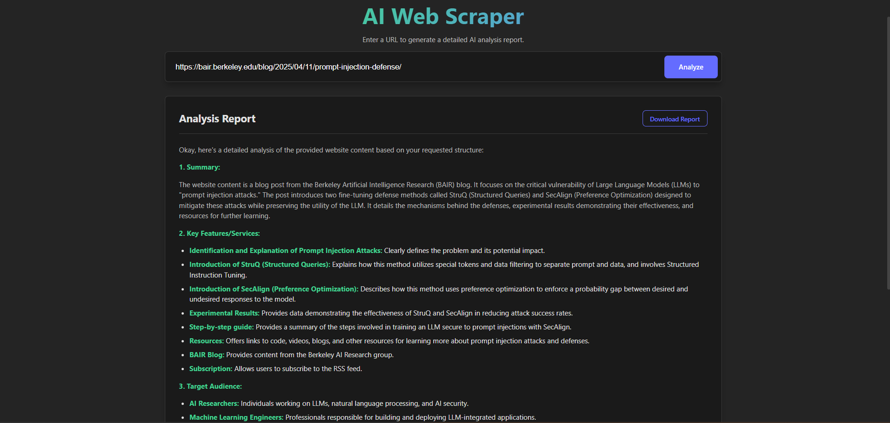

# AI Powered Web Scraper

An intelligent web scraping application that uses AI to analyze scraped content and generate detailed reports. The project consists of a FastAPI backend and a React frontend.

## Features

- **Web Scraping**: Extracts content from websites using Playwright and BeautifulSoup.
- **AI Analysis**: Uses Google's Generative AI to analyze the scraped content.
- **Modern UI**: Clean and responsive interface built with React and Vite.

## Tech Stack

### Backend
- **Framework**: FastAPI
- **Scraping**: Playwright, BeautifulSoup4
- **AI**: Google Generative AI
- **Language**: Python

### Frontend
- **Framework**: React
- **Build Tool**: Vite
- **Styling**: CSS

## Prerequisites

- Node.js (v18 or higher)
- Python (v3.8 or higher)
- Google Gemini API Key

## Installation & Running

### 1. Backend Setup

Navigate to the backend directory:
```bash
cd backend
```

Create and activate a virtual environment:
```bash
# Windows
python -m venv venv
.\venv\Scripts\activate

# macOS/Linux
python3 -m venv venv
source venv/bin/activate
```

Install dependencies:
```bash
pip install -r requirements.txt
playwright install
```

Create a `.env` file in the `backend` directory and add your API key:
```env
GEMINI_API_KEY=your_api_key_here
```

Run the backend server:
```bash
python main.py
```
The backend will run on `http://localhost:8000`.

### 2. Frontend Setup

Navigate to the frontend directory:
```bash
cd frontend
```

Install dependencies:
```bash
npm install
```

Run the development server:
```bash
npm run dev
```
The frontend will run on `http://localhost:5173`.

## Usage

1. Start both the backend and frontend servers.
2. Open the frontend URL in your browser.
3. Enter a website URL to scrape.
4. View the AI-generated analysis report.
